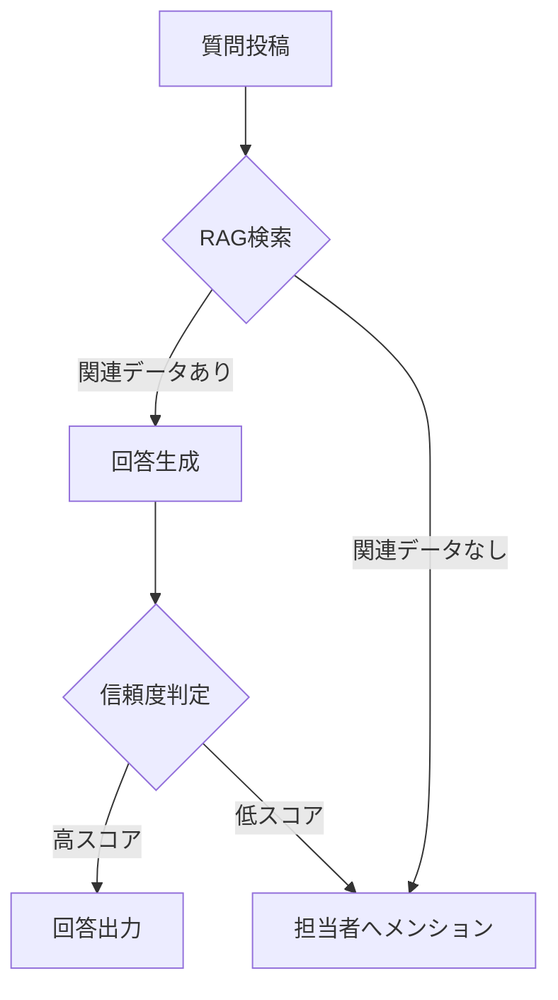

# 03. 技術構成とLLM活用策

## 1. システムアーキテクチャ
本システムは、セキュリティを重視し、社内データが外部の学習に利用されないエンタープライズグレードの構成を採用します。

### 技術スタック
- **LLM**: GPT-4o または Azure OpenAI Service（データセキュリティ確保のため）
- **検索技術**: RAG (Retrieval-Augmented Generation)
- **データベース**: Vector Database (Pinecone, Chroma等)
- **インターフェース**: Slack Bolt / MS Teams SDK

## 2. RAG (検索増強生成) による精度向上
LLMの一般的な知識に頼るのではなく、**「自社特有のデータ」**を基に回答させるため、RAG構成を中核に据えます。

- **データソース**:
    - 会計システムの過去仕訳明細（CSV/Excel）
    - 社内経理規程（PDF）
    - 経営企画保有の問い合わせ履歴（Spreadsheet）
- **プロセス**:
    1. 質問をベクトル化し、関連する過去データの上位数件を抽出。
    2. 抽出したデータと質問をLLMに渡し、「この過去事例に基づき回答せよ」と指示。

## 3. 低精度時のエスカレーションロジック
プログラマティックな判定とLLMによる自己検閲を組み合わせます。

## 4. セキュリティとコンプライアンス
- **データの非公開性**: OpenAIのAPI利用規約（API経由のデータは学習に利用されない）および、必要に応じてプライベートなAzure環境での実行を徹底。
- **アクセス制御**: チャットツールの権限設定に準拠し、閲覧可能なデータを制限。

## 5. 実装のポイント
- **プロンプトエンジニアリング**: 「経理担当者としての口調」「不明な点は推測せずエスカレーションする」といった厳格なシステムプロンプトを設定。
- **評価用データセットの作成**: 導入前に代表的なQ&A 100問を用意し、回答精度の合格基準を定義。
